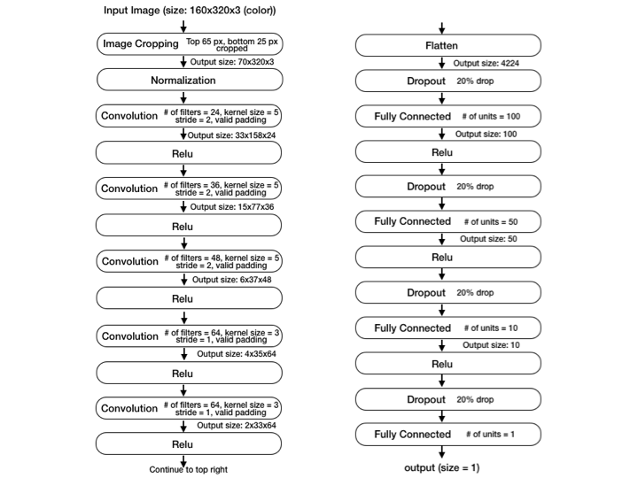
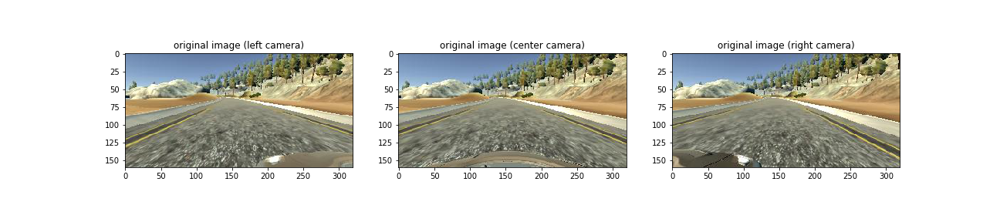
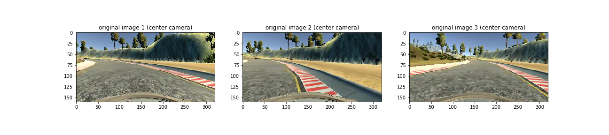
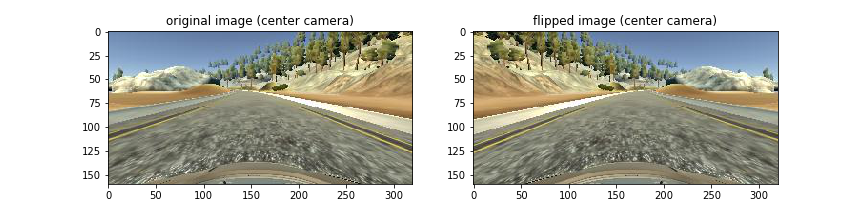
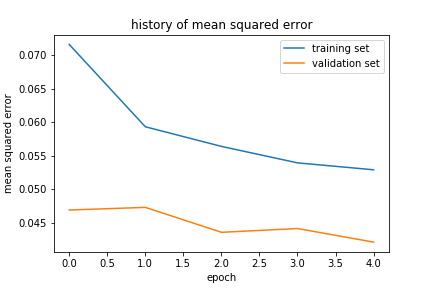

# Project: Behavioral Cloning

## Overview
The goal of this project is to build a convolutional neural network
(CNN) in Keras which predicts steering angles from images captured by
the cameras equipped to a car in the simulator. The data for
training/validating the model is collected by driving the car in the simulator. The performance of our model is checked by running
the car based on the model on the simulator.

## Model Architecture and Training Strategy
The main part of this project is to build a convolutional network
which takes as an input an image (height 160px, width 320px, 3 channels) of a road captured by the cameras equipped to the car in the simulator
and then returns the steering angle (which takes
a value in `[-1, 1]`). In this part, we will explain the detail of our model architecture and how to train it.
We use the mean squared error as the loss function and Adam optimizer
is used in the training process.

### 1. Approach
We first started with simple models with 1 or 2 convolutional layers
followed by 1 or 2 fully connected layers, but the performance was
not satisfactory (go out of the lane, a lot of oscillation to left and right etc.).
We thus mainly followed the architecture by
[NVIDIA](https://images.nvidia.com/content/tegra/automotive/images/2016/solutions/pdf/end-to-end-dl-using-px.pdf) which is made of 5 convolutional
layers followed by 4 fully connected layers. Some modifications/remarks
are in order:

- In order to normalize the elements in the array corresponding to a given image,
we have introduced a normalization layer which normalizes the elements such that they take values
in the range `[-0.5, 0.5]` (for the original images, each entry in the corresponding
array takes a value in the range `[0, 255]`).
- We also added another layer to crop the input images. This cropping layer
removes 65 pixels from the top and 25 pixels from the bottom
of the images. The removed part contains sceneries (apart from the road) and
a part of the car. This layer and the normalization layer above
are placed just before the convolutional layers.
- We also added some dropout layers (with drop rate `0.2`)
in the fully connected layer part
since the mean squared error for the model without the dropout layers
indicates overfitting, i.e. the error for the training set was much
smaller than that for the validation set.
- For the activation function followed by the convolutional layers
and the fully-connected layers, we have used the Rectified linear
unit (Relu).

### 2. Model Architecture
The architecture of our final model used in `model.py`
is summarized in the figure below:



### 3. Training/Validation Data Set
In the training/validation data taken by driving
the car in the simulator, each sample contains three images(from the center,
left and right cameras). The raw data is available at
[data for track1](https://www.dropbox.com/s/dvqycnpnfou97nv/data.zip?dl=0)
and [data for track2](https://www.dropbox.com/s/jtid1xlprml1d7s/data2.zip?dl=0).
An example of the images in the training/validation data is given below:



To generate data for the training/validation data set,
we drove on the track 1 for 4 laps
and on the track 2 for 3 laps. Mainly we drove such that the car stays
at the center of the road (the center of the right lane in the case of
track 2), but sometimes we intentionally moved the car away from the center
and then recovered back to the center so that our model can learn how to
recover to the center. An example of the images for going out of the lane and
recover from it in the training/validation set
is given below (time evolves from left to right):



To create the training/validation set from the generated data
We have first mixed up and shuffled the samples in the data
from the track 1 (`4903` samples) and track 2 (`7016` samples).
We then split into the training set
(80 % of the raw data) and the validation set (20% of the raw data).

For the training data, from each sample we have used the images
from the three cameras.The steering angle corresponding to the left (resp. right)
image is corrected by `0.2` (resp. `-0.2`) compared to the one corresponding
to the center image. The training data is augmented
by adding the flipped images (flipped with respect to the vertical axis
at the center of the image). We note that that the steering angle
for the flipped image is the minus of the one for the original image.
Here are the example of the flipped image:

<p align="center">
  
  <!--  -->
</p>

For the validation set, on the other hand,
we have used only the images from the center camera. This is because,
when in the auto-driving mode, our model takes the center camera image
as an input and then decides the steering angle.

To summarize, the number of the images in the training set
(and used for the training) is `9535x3x2 = 57210` (2 from the flipping
of the images and 3 from 3 cameras)
and that for the validation set is `2384`(no flipping, center camera
only).


### 4. Training Process

In the training process, the recorded steering angle (with a correction
as above) is compared with the output by our model. For the loss function,
the mean squared error is used. For the optimization, the Adam
optimizer is used. The batch size is taken to `32` and the number of
the epochs for the training is set to `5`.
The evolution of the loss for training/validation
set in the training process is summarized in the figure:

<p align="center">
  
</p>

## Performance
The performance of our model can be seen in the following videos:

- [Track1](https://youtu.be/csHD8Ud2liQ)
- [Track2](https://youtu.be/nGh4YQW0Zic)

<!-- <p align="center">
    <video width="320" height="240" controls>
      <source src="videos/run1.mp4" type="video/mp4">
    </video>
    &nbsp;&nbsp;&nbsp;&nbsp;&nbsp;&nbsp;
    <video width="320" height="240" controls>
      <source src="videos/run2.mp4" type="video/mp4">
    </video>
</p> -->

The car with our model drives the center of the road in
both track 1 and track 2 nicely. (One note: the performance of
the model depends on the specs of the computer to run it. As reported
in the Udacity forum, the speed of the car can become zero
in the middle of the journey if the memory size of the computer is small.
For recording the performance, we have run our model on iMac with 16GB memory.)

## Summary
We have built a CNN model for cloning the behavior of the car
in the simulator. To train our model, we have collected the image
data of the road captured by driving the car in the simulator.
The car with our CNN models drives the middle of the road safely.

<!-- ## Writeup Template

### You can use this file as a template for your writeup if you want to submit it as a markdown file, but feel free to use some other method and submit a pdf if you prefer. -->

<!-- -- --- --

**Behavioral Cloning Project**

The goals / steps of this project are the following:
* Use the simulator to collect data of good driving behavior
* Build, a convolution neural network in Keras that predicts steering angles from images
* Train and validate the model with a training and validation set
* Test that the model successfully drives around track one without leaving the road
* Summarize the results with a written report


[//]: # (Image References)

[image1]: ./examples/placeholder.png "Model Visualization"
[image2]: ./examples/placeholder.png "Grayscaling"
[image3]: ./examples/placeholder_small.png "Recovery Image"
[image4]: ./examples/placeholder_small.png "Recovery Image"
[image5]: ./examples/placeholder_small.png "Recovery Image"
[image6]: ./examples/placeholder_small.png "Normal Image"
[image7]: ./examples/placeholder_small.png "Flipped Image"

## Rubric Points
### Here I will consider the [rubric points](https://review.udacity.com/#!/rubrics/432/view) individually and describe how I addressed each point in my implementation.  

---
### Files Submitted & Code Quality

#### 1. Submission includes all required files and can be used to run the simulator in autonomous mode

My project includes the following files:
* model.py containing the script to create and train the model
* drive.py for driving the car in autonomous mode
* model.h5 containing a trained convolution neural network
* writeup_report.md or writeup_report.pdf summarizing the results

#### 2. Submission includes functional code
Using the Udacity provided simulator and my drive.py file, the car can be driven autonomously around the track by executing
```sh
python drive.py model.h5
```

#### 3. Submission code is usable and readable

The model.py file contains the code for training and saving the convolution neural network. The file shows the pipeline I used for training and validating the model, and it contains comments to explain how the code works.

### Model Architecture and Training Strategy

#### 1. An appropriate model architecture has been employed

My model consists of a convolution neural network with 3x3 filter sizes and depths between 32 and 128 (model.py lines 18-24)

The model includes RELU layers to introduce nonlinearity (code line 20), and the data is normalized in the model using a Keras lambda layer (code line 18).

#### 2. Attempts to reduce overfitting in the model

The model contains dropout layers in order to reduce overfitting (model.py lines 21).

The model was trained and validated on different data sets to ensure that the model was not overfitting (code line 10-16). The model was tested by running it through the simulator and ensuring that the vehicle could stay on the track.

#### 3. Model parameter tuning

The model used an adam optimizer, so the learning rate was not tuned manually (model.py line 25).

#### 4. Appropriate training data

Training data was chosen to keep the vehicle driving on the road. I used a combination of center lane driving, recovering from the left and right sides of the road ...

For details about how I created the training data, see the next section.

### Model Architecture and Training Strategy

#### 1. Solution Design Approach

The overall strategy for deriving a model architecture was to ...

My first step was to use a convolution neural network model similar to the ... I thought this model might be appropriate because ...

In order to gauge how well the model was working, I split my image and steering angle data into a training and validation set. I found that my first model had a low mean squared error on the training set but a high mean squared error on the validation set. This implied that the model was overfitting.

To combat the overfitting, I modified the model so that ...

Then I ...

The final step was to run the simulator to see how well the car was driving around track one. There were a few spots where the vehicle fell off the track... to improve the driving behavior in these cases, I ....

At the end of the process, the vehicle is able to drive autonomously around the track without leaving the road.

#### 2. Final Model Architecture

The final model architecture (model.py lines 18-24) consisted of a convolution neural network with the following layers and layer sizes ...

Here is a visualization of the architecture (note: visualizing the architecture is optional according to the project rubric)

![alt text][image1]

#### 3. Creation of the Training Set & Training Process

To capture good driving behavior, I first recorded two laps on track one using center lane driving. Here is an example image of center lane driving:

![alt text][image2]

I then recorded the vehicle recovering from the left side and right sides of the road back to center so that the vehicle would learn to .... These images show what a recovery looks like starting from ... :

![alt text][image3]
![alt text][image4]
![alt text][image5]

Then I repeated this process on track two in order to get more data points.

To augment the data sat, I also flipped images and angles thinking that this would ... For example, here is an image that has then been flipped:

![alt text][image6]
![alt text][image7]

Etc ....

After the collection process, I had X number of data points. I then preprocessed this data by ...


I finally randomly shuffled the data set and put Y% of the data into a validation set.

I used this training data for training the model. The validation set helped determine if the model was over or under fitting. The ideal number of epochs was Z as evidenced by ... I used an adam optimizer so that manually training the learning rate wasn't necessary. -->
